# FLEXIN By Shivam

FLEXIN is the ultimate e-commerce front-end solution based on Bootstrap 3. Along with styling all default components of popular framework it introduces lots of new flexible elements you can use across the website. In total 25+ components.

<!-- demo -->
## Example Site

| [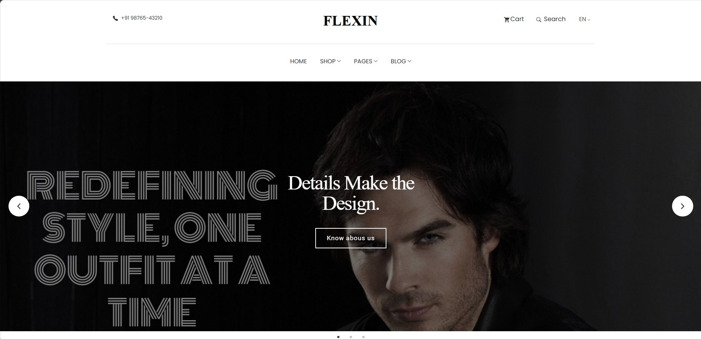](https://flexin-ecommerce-website.netlify.app/) | [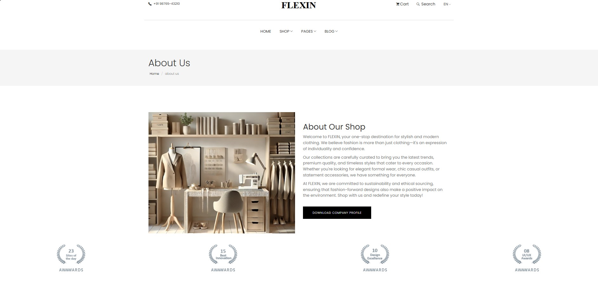](https://flexin-ecommerce-website.netlify.app/) | [](https://flexin-ecommerce-website.netlify.app/) | [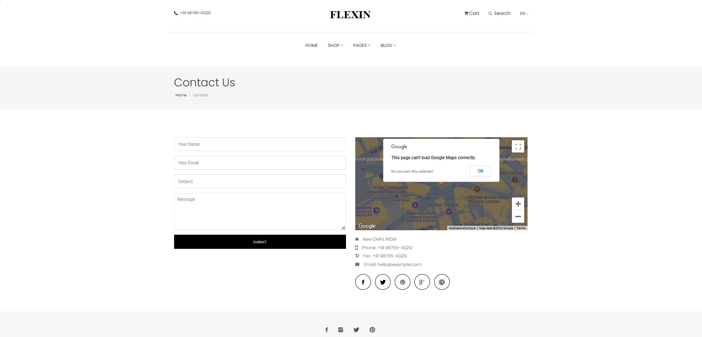](https://flexin-ecommerce-website.netlify.app/) |
|:---:|:---:|:---:|:---:|
| **Home**  | **About**  | **Pricing** | **Contact** |
| [](https://flexin-ecommerce-website.netlify.app/) | [](https://flexin-ecommerce-website.netlify.app/) | [](https://flexin-ecommerce-website.netlify.app/) | [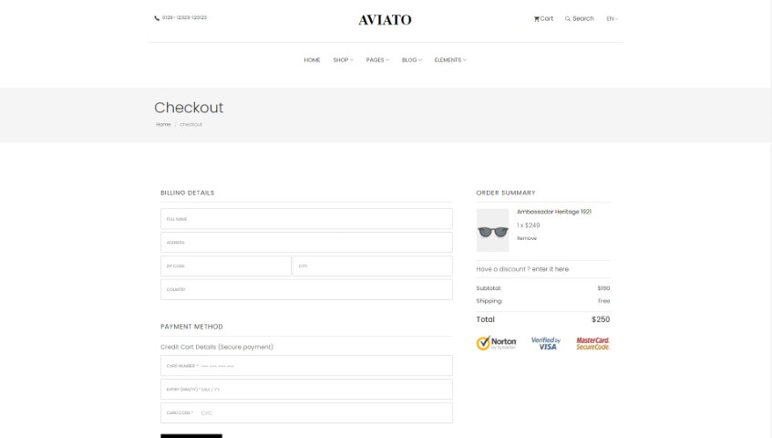](https://flexin-ecommerce-website.netlify.app/) |
| **Shop**  | **Single Product**  | **Cart** | **Checkout** |
| [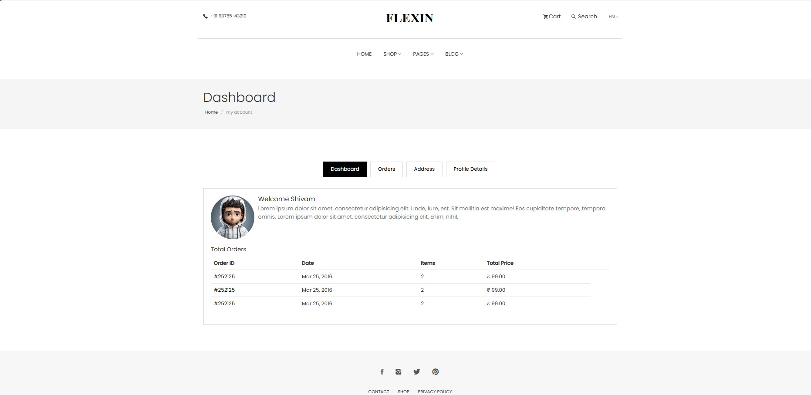](https://flexin-ecommerce-website.netlify.app/) | [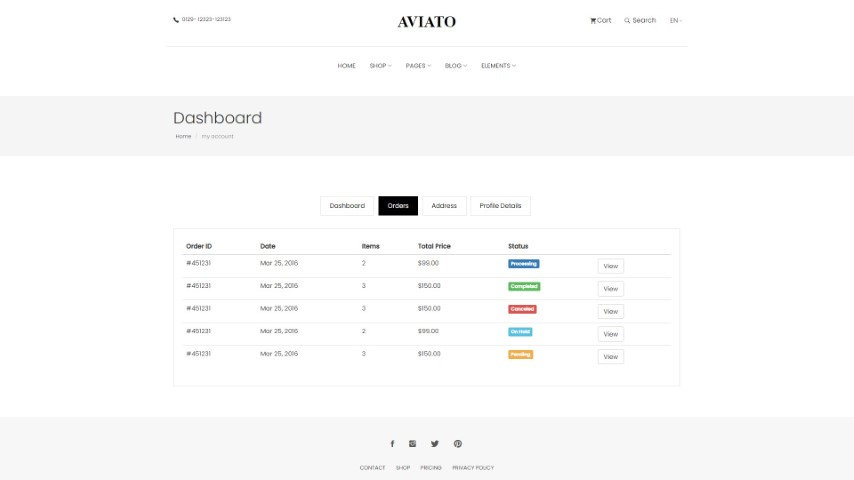](https://flexin-ecommerce-website.netlify.app/) | [](https://flexin-ecommerce-website.netlify.app/) | [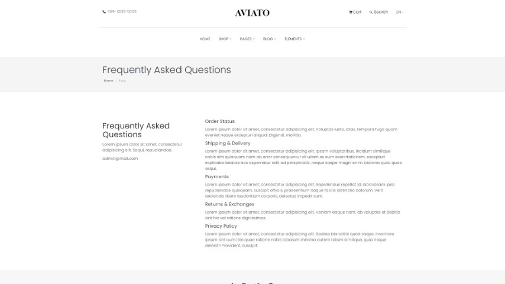](https://flexin-ecommerce-website.netlify.app/) |
| **Dashboard**  | **Orders**  | **Payment** | **FAQ** |
| [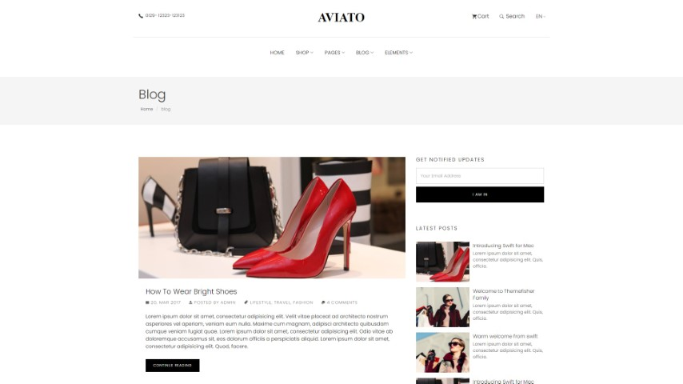](https://flexin-ecommerce-website.netlify.app/) | [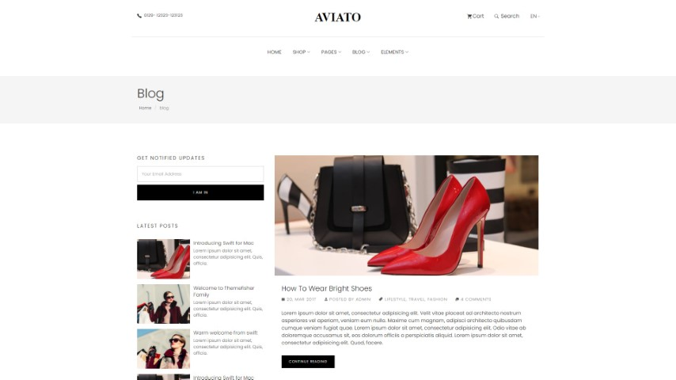](https://flexin-ecommerce-website.netlify.app/) | [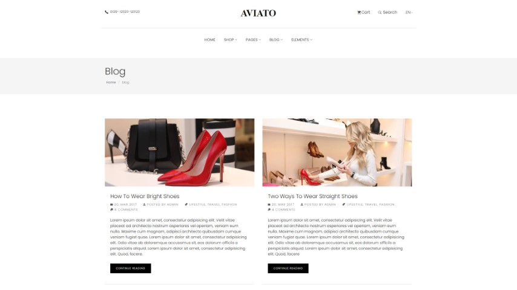](https://flexin-ecommerce-website.netlify.app/) | [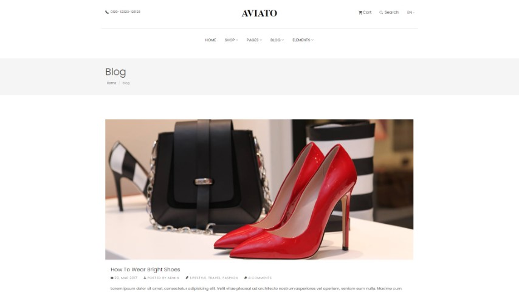](https://flexin-ecommerce-website.netlify.app/) |
| **Blog Right Sidebar**  | **Blog Left Sidebar**  | **Blog Grid** | **Blog Full Width** |

👉🏻[View Live Preview](https://flexin-ecommerce-website.netlify.app/)

<!-- resources -->
## Pages

* **Home**
* **About**
* **Pricing**
* **Shop**
* **Shop Sidebar**
* **Product Single**
* **Profile Details**
* **Dashboard**
* **Address**
* **Cart**
* **Empty Cart**
* **Checkout**
* **Order Confirmation**
* **Purchase Confirmation**
* **Payment Confirmation**
* **FAQ**
* **Blog Grid**
* **Blog Full Width**
* **Blog Left Sidebar**
* **Blog Right Sidebar**
* **Blog Single**
* **Contact**
* **404**
* **Coming Soon**
* **Login**
* **Signup**
* **Forget Password**
* **Alerts**
* **Buttons**
* **typography**

<!-- download -->
## Download And installation

Download this template from [Github](https://github.com/Shivamgpt812/Flexin---Ecommerce-Website)

<!-- installation -->
### Basic Usages

After downloading the template, you can simply edit the HTML and CSS files from the `theme` folder. To preview the changes you make to the code, you can open the index.html file in your web browser.

### Advanced Usage

For advanced usage, you have some prerequisites to install. Then you can run it on your localhost. You can view the package.json file to see which scripts are included.

#### Install prerequisites (once for a machine)

* **Node Installation:** [Install node js](https://nodejs.org/en/download/)
* **Gulp Installation:** Install gulp globally from your terminal

```
npm install --global gulp-cli
```

Or visit the original [Gulp docs](https://gulpjs.com/docs/en/getting-started/quick-start)

#### Local setup

After successfully installing those dependencies, open this theme with any IDE [[VS Code](https://code.visualstudio.com/) recommended], and then open the internal terminal of IDM [vs code shortcut <code>ctrl/cmd+\`</code>]

* Install dependencies

```
npm install
```

* Run locally

```
npm run dev
```

After that, it will open up a preview of the template in your default browser, watch for changes to source files, and live reload the browser when changes are saved.

#### Production Build

After finishing all the customization, you can create a production build by running this command.

```
npm run build
```

Now you get a `theme` folder that has all the changes you have made. you can use this folder as your main theme.

👉🏻 [visit documentation](https://docs.Shivam.com/FLEXIN/)

<!-- reporting issue -->
## Reporting Issues

We use GitHub Issues as the official bug tracker for the FLEXIN Template. Please Search [existing issues](https://github.com/Shivam/FLEXIN/issues). It’s possible someone has already reported the same problem.
If your problem or idea has not been addressed yet, feel free to [open a new issue](https://github.com/Shivam/FLEXIN/issues).

<!-- support -->
## Technical Support or Questions (Paid)

If you have questions or need help integrating the product please [contact us](mailto:mehedi@Shivam.com) instead of opening an issue.

<!-- licence -->
## License

Copyright (c) 2024 - Present, Designed & Developed by [Shivam](https://main--verdant-strudel-fa46fb.netlify.app/)

**Code License:** Released under the [MIT](https://github.com/Shivam/FLEXIN/blob/main/LICENSE) license.

**Image license:** The images are only for demonstration purposes. They have their license, we don't have permission to share those images.

<!-- resources -->
## Resources

Some third-party plugins that we used to build this template. Please check their license.

* **Bootstrap v3.3.7**: <https://getbootstrap.com/docs/3.3/getting-started/>
* **Jquery**: <https://jquery.com/download/>
* **Google Fonts**: <http://fonts.google.com/>
* **Slick**: <https://kenwheeler.github.io/slick/>
* **Ekko Lightbox**: <https://ashleydw.github.io/lightbox/>
* **Bootstrap TouchSpin**: <http://www.virtuosoft.eu/code/bootstrap-touchspin/>
* **Instafeed**: <https://github.com/stevenschobert/instafeed.js>
* **Smooth Scroll**: <http://github.com/cferdinandi/smooth-scroll>
* **SyoTimer**: <http://syomochkin.xyz/folio/syotimer/demo.html>
